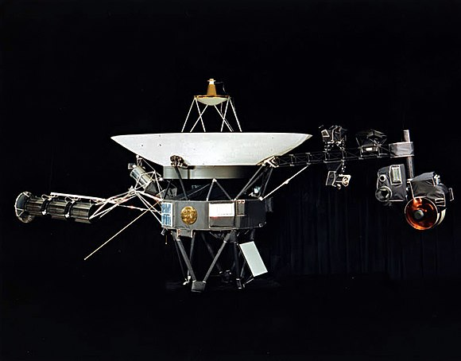

# voyager 1

Image trouvée sur [Wikipedia ](https://fr.wikipedia.org/wiki/Voyager_1).

Voyager 1 est l'une des deux sondes spatiales jumelles du programme spatial Voyager de la NASA destinées à l'étude des planètes externes du Système solaire qui n'avaient jusque-là été observées qu'au moyen de télescopes situés sur Terre, notamment les systèmes de Jupiter et de Saturne. Son lancement a eu lieu le 5 septembre 1977.

Voyager 1 est, avec sa sonde jumelle Voyager 2, à l'origine d'un grand nombre de découvertes sur le Système solaire remettant parfois en cause ou affinant les modèles théoriques existants et, à ce titre, une des missions spatiales les plus fructueuses de l'agence spatiale américaine. Parmi les résultats les plus remarquables figurent le fonctionnement complexe de la Grande Tache rouge de Jupiter, la première observation des anneaux de Jupiter, la découverte du volcanisme d'Io, la structure étrange de la surface d'Europe, la composition de l'atmosphère de Titan, la structure inattendue des anneaux de Saturne ainsi que la découverte de plusieurs petites lunes de Jupiter et de Saturne. La sonde est aussi à l'origine de la célèbre photographie Un point bleu pâle (Pale Blue Dot en anglais) de la planète Terre prise en 1990 à une distance de 6,4 milliards de kilomètres, ce qui en a fait la photographie la plus lointaine jamais prise pendant 27 ans.

La sonde spatiale fait preuve d'une grande longévité et dispose toujours en 2015 d'instruments opérationnels qui collectent des données scientifiques sur le milieu traversé. Elle a quitté en août 2012 l'héliosphère et progresse désormais dans le milieu interstellaire, même si à compter de 2020, les instruments devront néanmoins être progressivement arrêtés pour faire face à l'affaiblissement de sa source d'énergie électrique. Voyager 1 ne sera plus capable de transmettre de données au-delà de 20252. Au 7 septembre 2022, la sonde est à environ 23 562 919 160 kilomètres (157,476 unités astronomiques) du Soleil et à environ 23 558 175 505 kilomètres (157,508 unités astronomiques) de la Terre, ce qui en fait l'objet d'origine humaine le plus éloigné de la Terre.